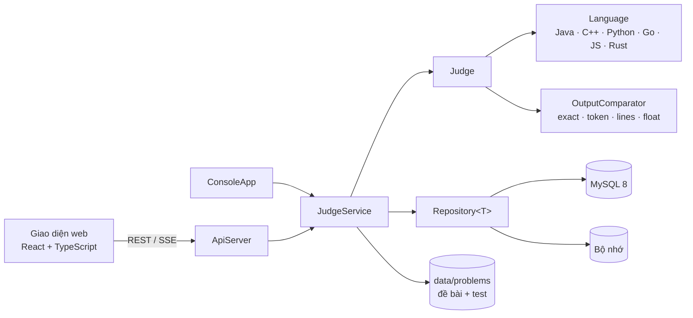

# PTIT Online Judge

Hệ thống chấm bài lập trình tự động: backend Java thuần, giao diện web React, chấm được 6 ngôn ngữ và trả kết quả theo thời gian thực.


## Giới thiệu

PTIT Online Judge là nền tảng luyện lập trình theo kiểu Codeforces. Người dùng nộp mã nguồn; hệ thống biên dịch, chạy trên bộ test với giới hạn thời gian và bộ nhớ, so sánh output với đáp án rồi trả verdict **AC / WA / TLE / MLE / RE / CE** cho từng test ngay khi chấm xong. Đi kèm là lộ trình học 10 chủ đề với 300 bài tập cho người mới bắt đầu.

Backend được viết trên API chuẩn của JDK. Máy chủ HTTP, bộ đọc/ghi JSON, băm mật khẩu và quản lý phiên đều tự cài đặt. Thư viện ngoài duy nhất là **MySQL Connector/J**, truy cập dữ liệu bằng JDBC thuần, không dùng framework hay ORM.

## Tính năng

**Chấm bài**
- Hỗ trợ 6 ngôn ngữ: Java, C++, Python, Go, JavaScript, Rust. Thêm ngôn ngữ mới chỉ cần viết một lớp con `Language`.
- Đủ 6 verdict, chấm điểm từng phần theo test.
- Kết quả trả về theo thời gian thực qua **Server-Sent Events**: test nào chấm xong là hiện ngay.
- 4 kiểu so sánh output: chính xác, theo token, theo dòng (cho bài vẽ hình), số thực có sai số.
- Test ẩn không bao giờ được gửi xuống trình duyệt, và thông báo WA không làm lộ đáp án.

**Học tập**
- Lộ trình 10 chủ đề, từ nhập/xuất đến mảng, xâu và thuật toán. Có theo dõi tiến độ từng chặng, nút *Học tiếp* và *Bài tiếp theo*.
- 300 bài tập (`K001`–`K300`) sinh tự động bằng bộ công cụ Python. Đáp án của mọi test được tính từ lời giải mẫu, không gõ tay.
- Lọc bài theo độ khó, đếm chuỗi ngày luyện tập, bảng xếp hạng và thống kê verdict.
- Trình soạn code CodeMirror 6 tô màu cú pháp cho cả 6 ngôn ngữ; bộ phân tích của từng ngôn ngữ chỉ được tải khi cần.

**Quản trị**
- Tạo bài tập trên web: đề, giới hạn, kiểu so sánh, test ví dụ và test ẩn. Bài được ghi ra ổ đĩa theo kiểu nguyên tử và dùng được ngay, không cần khởi động lại máy chủ.
- Sắp xếp lộ trình: đổi chủ đề, độ khó và vị trí của từng bài.
- Ba vai trò Học sinh / Giảng viên / Quản trị; quyền được kiểm tra ở backend chứ không chỉ ẩn nút trên giao diện.

**Bảo mật**
- Mật khẩu băm bằng PBKDF2-HMAC-SHA256 (120 000 vòng, salt riêng cho từng tài khoản) và so sánh trong thời gian hằng số.
- Token phiên 32 byte sinh bằng `SecureRandom`, hết hạn sau 8 giờ.
- Mọi truy vấn dùng `PreparedStatement`; mã bài và tên test được kiểm tra để chặn path traversal.
- Máy chủ chỉ lắng nghe trên `127.0.0.1`.

## Công nghệ

| Tầng | Công nghệ |
|---|---|
| Backend | Java 11, `com.sun.net.httpserver`, JDBC |
| Cơ sở dữ liệu | MySQL 8 (InnoDB, `utf8mb4`), hoặc lưu trong bộ nhớ khi chạy không có CSDL |
| Frontend | React 19, TypeScript 5, Vite 7, Tailwind CSS 4, CodeMirror 6 |
| Công cụ | Maven (tùy chọn), Python 3 (sinh bộ đề), script PowerShell / Bash |

## Kiến trúc



- **Một tầng nghiệp vụ cho hai giao diện.** Console và web cùng gọi `JudgeService`. Kho dữ liệu được tiêm qua constructor (`JudgeService.mysql()` / `JudgeService.inMemory()`), nên chuyển giữa MySQL và bộ nhớ không phải sửa tầng nghiệp vụ hay giao diện.
- **Phân tầng rõ ràng.** Câu SQL chỉ nằm trong package `repository` và `database`.
- **Chạy code thí sinh an toàn về tài nguyên.** `ProcessRunner` chạy chương trình trong tiến trình con: một luồng ghi stdin, hai luồng đọc stdout/stderr để tránh deadlock; có timeout, dừng cưỡng bức và giới hạn output 1 MB.

```
src/com/ptit/oj
├── model/        Entity, User → Student / Teacher / Admin, Problem, Topic, Submission, Verdict
├── language/     Language (abstract) → 6 ngôn ngữ, LanguageRegistry
├── compare/      OutputComparator → Exact / Token / Line / Float, ComparatorFactory
├── runner/       ProcessRunner
├── core/         Judge, JudgeListener → ConsoleJudgeListener / StatisticsListener
├── database/     DatabaseConfig, MySqlDatabaseManager, MySqlSchemaInitializer
├── repository/   Repository<T> (bản In-memory và MySQL), ProblemLoader / ProblemWriter, TopicLoader
├── service/      JudgeService, AuthService, PasswordService, SessionService,
│                 ProblemAdminService, ScoreboardService, StatisticsService
├── web/          ApiServer, Json, SseJudgeListener
├── ui/           ConsoleApp
└── test/         IntegrationTests
```

## Bắt đầu nhanh

**Yêu cầu:** JDK 11+, Node.js 20.19+. MySQL 8 chỉ cần khi muốn lưu dữ liệu lâu dài. Muốn chấm các ngôn ngữ khác Java thì cài thêm toolchain tương ứng (g++, Python 3, Go, Node.js, Rust); ngôn ngữ nào thiếu toolchain sẽ tự được đánh dấu là không khả dụng.

### Chạy thử không cần MySQL

```bash
git clone https://github.com/hienphung910/Online-Judge.git
cd Online-Judge
powershell -ExecutionPolicy Bypass -File run-web.ps1 -NoDb    # Linux / macOS: ./run-web.sh --no-db
```

Mở http://localhost:8080. Mật khẩu tài khoản `admin` được in ra terminal; muốn tự đặt thì gán biến môi trường `OJ_ADMIN_PASSWORD` trước khi chạy. Ở chế độ này tài khoản và lịch sử nộp bài nằm trong RAM nên sẽ mất khi tắt máy chủ.

Script tự tải MySQL Connector/J vào `lib/`, biên dịch backend, build frontend rồi khởi động máy chủ.

### Chạy với MySQL

1. Sửa mật khẩu `THAY_MAT_KHAU_NAY` trong `database/mysql/01_create_database.sql`, rồi chạy file này bằng tài khoản quản trị MySQL. Script tạo CSDL `online_judge`, `online_judge_test` và tài khoản `oj_app` với quyền tối thiểu:

   ```bash
   mysql -u root -p < database/mysql/01_create_database.sql
   ```

2. Tạo file cấu hình rồi điền các biến ở mục [Cấu hình](#cấu-hình):

   ```bash
   cp .env.example .env    # PowerShell: Copy-Item .env.example .env
   ```

3. Chạy `run-web.ps1` (hoặc `./run-web.sh`). Bảng và view được tạo tự động khi khởi động. Lần chạy đầu, hệ thống tạo tài khoản `admin` và 4 tài khoản mẫu.

### Script

| | Windows PowerShell | Windows cmd | Linux / macOS |
|---|---|---|---|
| Giao diện web | `run-web.ps1 [-Port 9000] [-NoDb]` | `run-web.bat` | `./run-web.sh [9000] [--no-db]` |
| Giao diện console | `run.ps1 [--no-db]` | `run.bat` | `./run.sh` |
| Toàn bộ kiểm thử | `run-tests.ps1` | `run-tests.bat` | `./run-tests.sh` |

Tham số của backend (`java -cp "out;lib/*" com.ptit.oj.Main ...`; Linux / macOS dùng `:` thay cho `;`):

| Tham số | Chức năng |
|---|---|
| *(không có)* | Menu console, yêu cầu đăng nhập |
| `--serve[=port]` | REST API và giao diện web, mặc định cổng 8080 |
| `--no-db` | Lưu dữ liệu trong bộ nhớ thay vì MySQL; dùng được với cả console lẫn `--serve` |
| `--demo` / `--selftest` | Chấm bộ bài nộp mẫu; `--selftest` đối chiếu với verdict kỳ vọng và trả exit code |
| `--apitest` | Kiểm thử tích hợp với MySQL |
| `--data=`, `--web=`, `--db-url=` | Đổi thư mục dữ liệu, thư mục frontend, URL CSDL |

## Cấu hình

Các biến được đọc từ biến môi trường hoặc file `.env` (biến môi trường được ưu tiên). Mật khẩu không bao giờ nhận qua tham số dòng lệnh.

| Biến | Ý nghĩa |
|---|---|
| `OJ_DB_URL`, `OJ_DB_USER`, `OJ_DB_PASSWORD` | Kết nối tới CSDL chính |
| `OJ_TEST_DB_URL`, `OJ_TEST_DB_USER`, `OJ_TEST_DB_PASSWORD` | Kết nối CSDL kiểm thử; tên CSDL bắt buộc kết thúc bằng `_test` |
| `OJ_ADMIN_PASSWORD` | Mật khẩu admin lần đầu; bỏ trống thì hệ thống tự sinh và in ra một lần |
| `OJ_SEED_PASSWORD` | Mật khẩu của 4 tài khoản mẫu |

## REST API

Trừ 4 endpoint công khai, mọi request phải gửi header `Authorization: Bearer <token>`.

| Method | Endpoint | Quyền | Mô tả |
|---|---|---|---|
| GET | `/api/health` | công khai | Trạng thái máy chủ |
| GET | `/api/languages` | công khai | Danh sách ngôn ngữ và trạng thái toolchain |
| POST | `/api/auth/register` | công khai | Đăng ký tài khoản học sinh |
| POST | `/api/auth/login` | công khai | Đăng nhập, trả về token |
| POST | `/api/auth/logout` | đăng nhập | Huỷ token |
| GET | `/api/auth/me` | đăng nhập | Thông tin tài khoản và số bài đã giải |
| GET | `/api/problems` | đăng nhập | Danh sách bài kèm đề, chủ đề, độ khó và test ví dụ |
| GET | `/api/topics` | đăng nhập | Lộ trình học theo thứ tự |
| GET | `/api/submissions` | đăng nhập | Lịch sử nộp: học sinh chỉ thấy của mình |
| GET | `/api/submissions/{id}` | chủ bài / GV / admin | Chi tiết từng test và mã nguồn |
| GET | `/api/scoreboard` | đăng nhập | Bảng xếp hạng |
| GET | `/api/stats` | đăng nhập | Thống kê verdict |
| POST | `/api/submit` | đăng nhập | Nộp bài, chờ chấm xong rồi trả kết quả |
| POST | `/api/submit/stream` | đăng nhập | Nộp bài, nhận kết quả từng test qua SSE |
| POST | `/api/admin/problems` | admin | Tạo bài tập |
| PUT | `/api/admin/problems/{id}` | admin | Đổi chủ đề, độ khó, vị trí trong lộ trình |

`/api/submit/stream` phát lần lượt các sự kiện `started` → `compiled` → `test` (mỗi test một sự kiện) → `finished` → `done`. Lỗi đầu vào được trả bằng mã HTTP 4xx trước khi mở luồng. Mã lỗi: `400` dữ liệu sai, `401` chưa đăng nhập, `403` không đủ quyền, `404` không tìm thấy, `409` trùng tên đăng nhập hoặc mã bài, `500` lỗi nội bộ (chi tiết chỉ ghi vào log máy chủ).

## Định dạng đề bài

Mỗi bài là một thư mục trong `data/problems/`:

```
P001/
├── problem.properties   id, title, timeLimitMs, memoryLimitMb, comparator, totalPoints,
│                        topic, difficulty, order (ba khoá cuối tùy chọn)
├── statement.txt        nội dung đề
└── tests/
    ├── sample01.in / sample01.out   test ví dụ (tên bắt đầu bằng "sample"), hiển thị cho người dùng
    └── 01.in / 01.out ...           test ẩn
```

- `comparator`: `exact`, `token` (mặc định), `lines`, `float` hoặc `float:1e-9`.
- `difficulty`: 1 Dễ, 2 Vừa, 3 Khó. `order`: thứ tự trong chủ đề; bài không có `order` xếp sau theo mã bài.
- Lộ trình khai báo trong `data/topics.txt`, mỗi dòng có dạng `ma-chu-de | Tên | Mô tả`; thứ tự dòng là thứ tự học.
- Bộ đề `K001`–`K300` sinh từ `tools/kids-problems/`, xem [tools/kids-problems/README.md](tools/kids-problems/README.md).

Lược đồ CSDL gồm ba bảng `users`, `submissions`, `test_case_results` (khoá ngoại `ON DELETE CASCADE`) và view `user_stats`. Mỗi bài nộp cùng kết quả các test được ghi trong một transaction. Xem [database/mysql/02_schema.sql](database/mysql/02_schema.sql).

## Kiểm thử

```bash
powershell -ExecutionPolicy Bypass -File run-tests.ps1
```

Script lần lượt biên dịch backend, chạy `--selftest`, `--apitest` và build frontend; có bước nào lỗi thì trả exit code khác 0.

- **`--selftest`** chấm 17 bài nộp mẫu, đủ 6 verdict và nhiều ngôn ngữ, rồi đối chiếu với verdict kỳ vọng trong `data/submissions/demo-plan.txt`. Không cần MySQL.
- **`--apitest`** chạy kiểm thử tích hợp trên MySQL thật qua HTTP: đăng ký, đăng nhập, phân quyền, mật khẩu không lưu dạng plaintext, chặn path traversal, không lộ test ẩn, transaction và khoá ngoại, dữ liệu còn nguyên sau khi khởi động lại. Bộ kiểm thử chỉ chạy trên CSDL có tên kết thúc bằng `_test`, và làm việc trên bản sao đề bài nên không ảnh hưởng dữ liệu thật. Nếu chưa cấu hình `OJ_TEST_DB_*`, bước này được bỏ qua.

## Thiết kế hướng đối tượng

| Nguyên lý / mẫu | Áp dụng |
|---|---|
| Kế thừa & đa hình | `User` → `Student` / `Teacher` / `Admin`; quyền lấy từ `canCreateProblem()` thay vì `if` theo vai trò |
| Trừu tượng | `Language`, `User`, `Entity` là abstract class; `OutputComparator`, `Repository<T>`, `JudgeListener` là interface |
| Strategy | `OutputComparator`: đổi cách so sánh mà không sửa `Judge` |
| Factory | `ComparatorFactory`, `LanguageRegistry`, `JudgeService.mysql()` / `inMemory()` |
| Observer | `JudgeListener` với 3 bản cài đặt: in console, thống kê, đẩy SSE; thêm mới không sửa `Judge` |
| Repository + Generic | `Repository<T extends Entity>`, hai bản cài đặt In-memory và MySQL thay thế được cho nhau |
| Dependency Injection | `JudgeService` nhận kho dữ liệu qua constructor |
| Đóng gói | Field `private`, danh sách trả về dạng chỉ đọc, `Credentials` bất biến và không in hash ra ngoài |
| Đa luồng | Luồng đọc/ghi riêng cho tiến trình con, `ConcurrentHashMap` cho phiên, chấm tuần tự để đo thời gian ổn định |

## Hạn chế và hướng phát triển

- Chưa có sandbox: code thí sinh chạy bằng quyền người dùng hiện tại, nên máy chủ chỉ mở trên localhost. Hướng phát triển: chạy trong container hoặc dùng cgroups / Job Object.
- Giới hạn bộ nhớ chỉ áp chính xác cho Java (`-Xmx`) và JavaScript; các ngôn ngữ còn lại chỉ phát hiện MLE khi runtime báo hết bộ nhớ.
- Bài được chấm tuần tự để số đo thời gian ổn định; có thể chuyển sang hàng đợi và nhiều worker.
- Trang Kỳ thi là bản demo, dữ liệu lưu trong `localStorage` của trình duyệt và chưa có API backend.
- Chưa sửa được nội dung đề, bộ test, chưa xoá bài và chưa đổi mật khẩu qua giao diện; lộ trình (`topics.txt`) vẫn sửa tay.
- Phiên đăng nhập lưu trong RAM; chưa có connection pool và phân trang cho lịch sử nộp bài.

## Nhóm phát triển

Bài tập lớn môn Lập trình hướng đối tượng, Học viện Công nghệ Bưu chính Viễn thông (PTIT).

Thành viên: **hienphung910** , **longnd** , **tm079**,**tienkhoi235**
